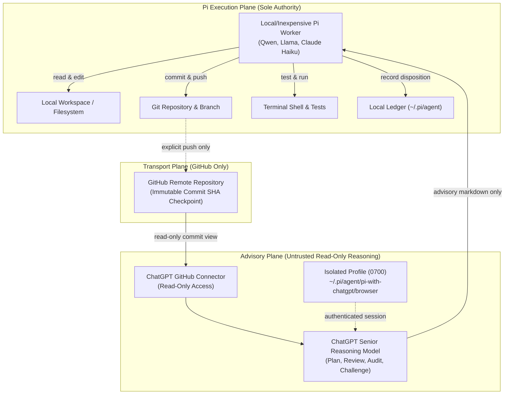

# Architecture & Safety Invariants

[Home]({{ site.baseurl }}/) | [Getting Started]({{ site.baseurl }}/getting-started/) | [User Guide]({{ site.baseurl }}/user-guide/) | [Agent Tools]({{ site.baseurl }}/agent-tools/) | [Configuration]({{ site.baseurl }}/configuration/) | [Drift]({{ site.baseurl }}/drift-and-disposition/) | [Troubleshooting]({{ site.baseurl }}/troubleshooting/) | [Architecture]({{ site.baseurl }}/architecture-and-safety/)

---

`pi-with-chatgpt` is architected around a strict security model and formal invariants. In modern agentic programming, a frontier model must serve as a **high-trust thinker**, not a high-privilege runner.

---

## The Core Invariant Architecture

---

## The 16 Architecture Invariants

Every release of `pi-with-chatgpt` is verified against the project's 16 core architecture invariants:

### 1. INV-01: Execution Ownership
**ChatGPT advises. Pi decides and executes.**
Adviser output is untrusted input. ChatGPT has zero execution authority: it cannot execute shell commands, edit files directly, run tests, or trigger automated workflows. The Pi worker or user evaluates all recommendations and remains the sole author of changes.

### 2. INV-02: GitHub-Only Context Channel in V1
**Source code travels exclusively via GitHub.**
The extension contains no code path for archiving, zipping, uploading, tunneling, or bridging local files to OpenAI servers. Context reaches ChatGPT exclusively through the authorized GitHub connector app.

### 3. INV-03: Immutable Commit Checkpoint
**Every consultation anchors to an exact 40-character commit SHA.**
Consultations are never ambiguous or floating. Advice is anchored to a specific git commit object (`refs/heads/...^{commit}`). A consultation is never silently retargeted if the local working tree changes.

### 4. INV-04: Checkpoint Remote Reachability
**Availability on the GitHub remote is verified before dispatch.**
Before sending any prompt to ChatGPT, the extension verifies that the anchor commit SHA exists and is reachable on the configured GitHub remote (`git ls-remote`). If the commit is unpushed, the consultation is refused with actionable guidance.

### 5. INV-05: Dual Cursors & Drift Measurement
**Development never blocks on advice.**
The extension tracks both the **adviser checkpoint** and the **active execution cursor** (`HEAD`). When advice arrives, the extension computes graph distance and file-level modifications to assign one of five drift tiers (`current`, `likely_applicable`, `materially_stale`, `needs_reconsultation`, or `provenance_degraded`).

### 6. INV-06: Zero Git Write Authority
**The extension never commits or pushes.**
The extension contains zero calls to `git add`, `git commit`, `git push`, or any mutating git command. Consultations are strictly read-only inspections.

### 7. INV-07: Non-Blocking Advisory Failure
**Advisory failures degrade to local worker execution.**
Under default configuration (`dependencyDefault: "advisory"`), rate limits, network timeouts, or expired browser sessions never freeze your terminal or agent. The failure is logged and the local Pi worker continues executing.

### 8. INV-08: Strict Provider and Task Scoping
**One ChatGPT Project per repository; one conversation per task.**
To prevent cross-project context pollution, each GitHub repository maps to its own ChatGPT Project. Inside that project, conversations are scoped per task ID, preserving thread memory while isolating unrelated work.

### 9. INV-09: Human Verification Protection
**No automated solving of CAPTCHAs or 2FA.**
The extension never attempts to automate or bypass Cloudflare, Arkose, or Multi-Factor Authentication challenges. If a human verification gate is encountered, automation halts immediately, prompting the user to solve it via `/advisor-auth`.

### 10. INV-10: State Opacity
**Tokens and session cookies never enter model context or logs.**
ChatGPT session cookies, auth tokens, and sensitive headers are strictly contained within the browser storage engine. They are stripped from logs, redacted from error messages, and never passed into prompt contexts.

### 11. INV-11: Isolated Browser Profile
**Your personal browser is never automated.**
Browser automation operates exclusively in a private, dedicated Playwright profile (`~/.pi/agent/pi-with-chatgpt/browser`). The extension verifies on startup that directory permissions are restricted to owner-only (`0700`) and refuses to launch if permissions allow group or other access.

### 12. INV-12: Safe Configuration Containment
**Configuration cannot store credentials.**
Any configuration key matching tokens, cookies, or secrets is rejected with an explanatory error. Furthermore, project-level configurations cannot override security-critical settings (such as forcing blocking dependencies or changing browser binaries).

### 13. INV-13: Prompt-Injection Resistance
**Repository content is untrusted input.**
Repository code and PR comments are treated as untrusted data. Prompts sent to ChatGPT include delimiters and instructions that prevent untrusted code from hijacking the consultation format.

### 14. INV-14: Asynchronous Resilience
**Clean lifecycle and crash recovery.**
Consultations running in background modes survive terminal interrupts and browser restarts. Background polling utilizes coarse backoff to prevent resource exhaustion.

### 15. INV-15: Durable Local Ledger & Mandatory Rationale
**Every consultation is auditable; rejections require justification.**
All requests, responses, and action items (`A1`, `A2`, …) persist in an append-only local JSONL ledger. If a worker or user marks an action item as `rejected_with_reason` or `superseded`, a mandatory rationale string must be recorded.

### 16. INV-16: Privacy & Local Persistence
**No automatic public posting.**
Consultation advice and worker dispositions remain on your local disk. The extension never automatically publishes comments to GitHub issues, PRs, or public channels without explicit user action.
