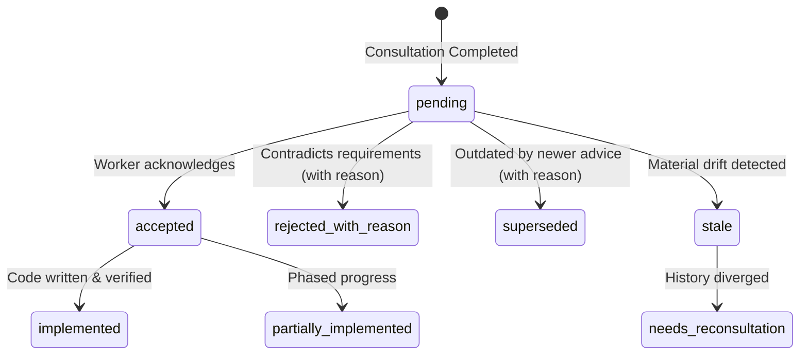

# Drift & Disposition Guide

[Home]({{ site.baseurl }}/) | [Getting Started]({{ site.baseurl }}/getting-started/) | [User Guide]({{ site.baseurl }}/user-guide/) | [Agent Tools]({{ site.baseurl }}/agent-tools/) | [Configuration]({{ site.baseurl }}/configuration/) | [Drift]({{ site.baseurl }}/drift-and-disposition/) | [Troubleshooting]({{ site.baseurl }}/troubleshooting/) | [Architecture]({{ site.baseurl }}/architecture-and-safety/)

---

In real-world software engineering, development does not freeze while waiting for an architectural review or code review. You and your Pi worker continue writing code, running tests, and making commits.

`pi-with-chatgpt` is built from the ground up around **asynchronous dual cursors** and **auditable action-item dispositions**.

---

## The Dual-Cursor Model

Every consultation maintains two independent coordinates:

```text
Commit History:
A ───────▶ B ───────▶ C ───────▶ D ───────▶ E (current HEAD)
           ▲                                ▲
    Adviser Checkpoint              Pi Execution Cursor
   (anchored commit SHA)             (active development)
```

1. **Adviser Checkpoint**: The exact, immutable 40-character commit SHA (e.g. `B`) that was pushed to GitHub and reviewed by ChatGPT.
2. **Execution Cursor**: The local repository `HEAD` (e.g. `E`), which may have advanced by several commits or even branched since the consultation was dispatched.

Because the advice is permanently anchored to `B`, it never silently retargets to `E`. Instead, when advice is returned, the extension computes the **drift** between `B` and `E`.

---

## Graph Drift vs. File Drift

Drift calculation operates at two complementary levels:

### 1. Graph Drift (`analyzeGraphDrift`)
Measures the topological relationship between the checkpoint commit and current `HEAD`:
- **Identical**: `HEAD` equals checkpoint (`checkpoint == HEAD`).
- **Ahead**: `HEAD` is a direct descendant of the checkpoint (linear progression).
- **Behind**: `HEAD` is an ancestor of checkpoint (e.g. user checked out an earlier commit).
- **Diverged**: Both branches have unique commits (e.g. after rebase, branch switch, or force-push).

### 2. File Drift (`analyzeFileDrift`)
Extracts the exact files mentioned in the adviser's recommendations and checks git history between checkpoint and `HEAD`:
- Has `src/auth/session.ts` been modified since the review was requested?
- Did a refactoring move or delete any affected modules?

---

## The 5 Drift Classifications

By combining graph distance with file-level modifications, `pi-with-chatgpt` classifies advice into one of five unambiguous tiers:

| Tier | Classification | Condition | Recommended Worker Action |
| --- | --- | --- | --- |
| 🟢 | **`current`** | `HEAD` is exactly at the checkpoint commit SHA. | Apply advice directly with full confidence. |
| 🟡 | **`likely_applicable`** | `HEAD` is ahead of checkpoint, but **none** of the mentioned files have changed. | Safe to apply. Recommendations remain valid. |
| 🟠 | **`materially_stale`** | One or more files referenced in the advice were modified in subsequent commits. | **Inspect diffs**. Changes may have addressed or invalidated parts of the advice. |
| 🔴 | **`needs_reconsultation`** | Commit history has diverged (rebase/merge), or significant structural drift occurred. | Use `/advisor-followup` or dispatch a new consultation anchored to current `HEAD`. |
| ⚪ | **`provenance_degraded`** | Checkpoint commit cannot be found in local or remote git history. | Re-anchor to current `HEAD`. Advice has lost provenance. |

You can inspect the drift tier of any consultation at any time using:
```text
/advisor-status
```
or via the agent tool:
```json
advisor_status({ "consultationId": "adv-c902-1" })
```

---

## Action Item Disposition Lifecycle

Frontier model reviews often contain several distinct recommendations: refactors, test additions, edge case protections, or documentation fixes.

`pi-with-chatgpt` parses these recommendations into structured, numbered **Action Items** (`A1`, `A2`, `A3`, …) and stores them in the durable local ledger (`~/.pi/agent/pi-with-chatgpt/ledger.jsonl`).



### Supported Disposition States

| Disposition | Meaning | Requires Rationale? |
| --- | --- | --- |
| `pending` | Action item identified, awaiting worker or user attention. | No |
| `accepted` | Worker or user intends to implement this recommendation. | No |
| `implemented` | Code changes applied and tests verified. | No |
| `partially_implemented` | Initial progress made; remainder pending. | No |
| `rejected_with_reason` | Recommendation explicitly declined. | **YES (INV-15)** |
| `superseded` | Replaced by subsequent advice or architectural decision. | **YES (INV-15)** |
| `stale` | Code changes rendered recommendation obsolete. | Optional |
| `needs_reconsultation` | Divergence requires follow-up advisory input. | Optional |

---

## Enforcing Accountability: Mandatory Rationale (INV-15)

To prevent models or users from silently ignoring critical safety advice, `pi-with-chatgpt` enforces an architectural invariant:

> **Invariant INV-15**: Any action item marked as `rejected_with_reason` or `superseded` **must** include a non-empty `reason` string explaining why the recommendation was not adopted.

If a worker attempts to reject an item without justification, the ledger and the `advisor_disposition` tool will reject the operation:

```text
Error: Mandatory rationale required when rejecting or superseding action item A2.
```

### Recording Dispositions via Agent Tool

```json
{
  "consultationId": "adv-c902-1",
  "actionItemId": "A1",
  "disposition": "implemented"
}
```

Or for a rejection:

```json
{
  "consultationId": "adv-c902-1",
  "actionItemId": "A2",
  "disposition": "rejected_with_reason",
  "reason": "Redis is already our primary session store; adding Memcached introduces redundant operational overhead."
}
```

---

## Seamless Follow-Ups with Context Carryover

When you run `/advisor-followup` (or call `advisor_followup`), the extension automatically builds a **follow-up brief**:

1. Re-attaches to the exact ChatGPT task conversation.
2. Informs the adviser of all prior action items and their current dispositions (`implemented`, `rejected`, etc.).
3. Quantifies the drift that occurred between the initial checkpoint and your new commit.
4. Frames your follow-up question in the context of what has already changed!
